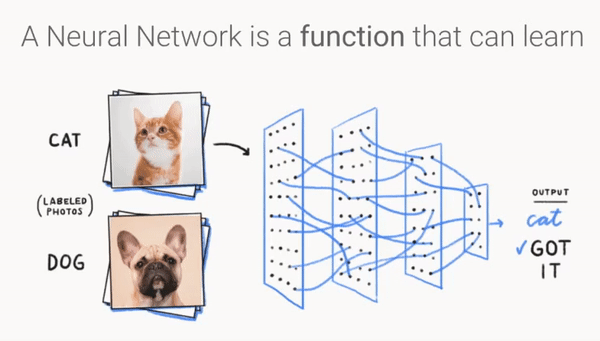
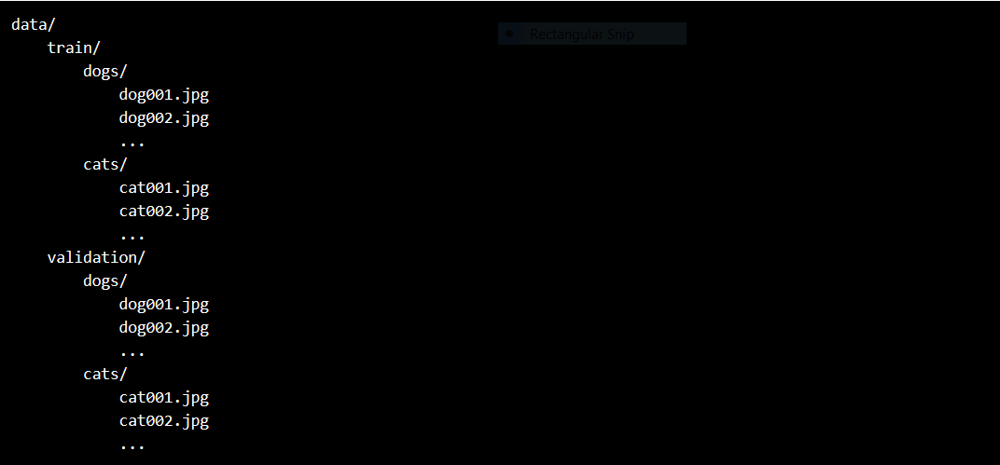

# DogsVsCats
This repository consist of three different types of technique that can be used for image classification task by using very little amount of dataset. These models are developed in such a way that they can distinguish between images , in this particular case i made a binary image classifier to diffrentiate between images of cats and dogs. The techniques that are used here are :-

* 1st_convNet.ipynb :- Training a small network from scratch (as a baseline model).
* 2nd_convNet.ipynb :- Using the bottleneck features of a pre-trained network.
* 3rd_convNet.ipynb :- Fine-tuning the top layers of a pre-trained network.

#### A machine with keras, SciPy, PIL and cuDNN installed will sufficient for this task.

## Dataset :
Dataset is available <a href ="https://www.kaggle.com/c/dogs-vs-cats/data">Over here</a>. It is a big dataset so sample out only 1000 images of each class(dog and cat) for training and about 300 images for validation . Store these images in the following manner :-

* A directory must contain one subdirectory per class where each subdirectory will be treated as a different class, so here label of an image is set in the form of directory name. 
* Images in a directory will be consider to have label as the name of that directory that they are stored in .

##### Reference :-
* For the detailed explanation from scratch , refer <a href ="https://blog.keras.io/building-powerful-image-classification-models-using-very-little-data.html">The Keras Blog</a>

You can observe just by using transfer learning we can boost the accuracy of model by a huge margin , almost upto the optimal solution.

### :)
